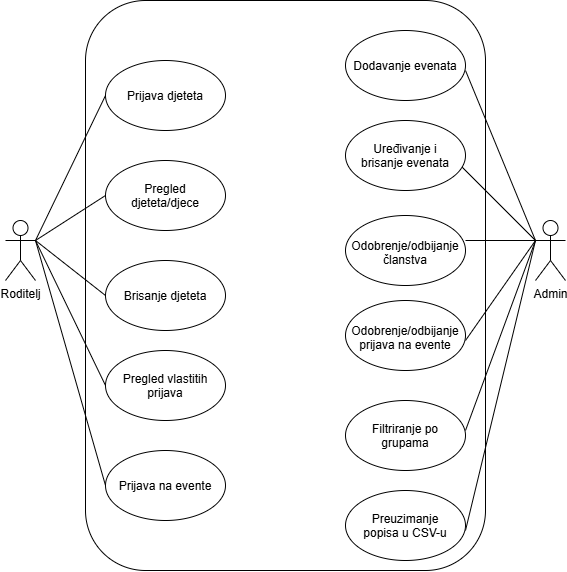
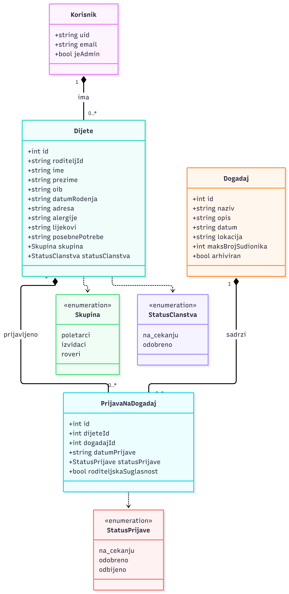

# Scouter

Aplikacija za prijavu djece u izviđačku udrugu i na događaje

Leon Radola
Fakultet informatike u Puli
Kolegij: Programsko inženjerstvo
Mentor: doc. dr. sc. Nikola Tanković

Pula, rujan 2026.

---

## 1. Sažetak

Scouter je web aplikacija namijenjena izviđačkim udrugama i roditeljima njihovih članova. Roditelj preko aplikacije prijavljuje dijete u udrugu, unosi njegove osnovne podatke te podatke bitne za sigurnost, poput alergija, lijekova i posebnih potreba. Nakon što administrator odobri članstvo, roditelj može dijete prijaviti na događaje koje udruga organizira, uz obaveznu potvrdu roditeljske suglasnosti.

Administrator ima vlastito sučelje u kojem dodaje, uređuje, arhivira i briše događaje, određuje najveći broj sudionika, odobrava ili odbija prijave te filtrira članove po skupini. Popis sudionika pojedinog događaja i popis članova može preuzeti u CSV formatu.

Aplikacija zamjenjuje papirnate prijavnice, ručno prepisivanje podataka i neuredne popise po porukama. Izrađena je u okviru kolegija Programsko inženjerstvo koristeći Vue 3, Vue Router, Pinia, Tailwind CSS i Firebase Authentication.

---

## 2. Uvod i motivacija

### 2.1. Opis aplikacije i ciljano tržište

Ciljano tržište aplikacije su manje izviđačke udruge u Hrvatskoj, kojih je nekoliko desetaka i koje uglavnom rade na volonterskoj osnovi, bez zaposlenog administrativnog osoblja. Aplikacija se može koristiti i u sličnim organizacijama koje rade s djecom, poput sportskih klubova i planinarskih društava, ali to nije primarno tržište.

Korisnici se dijele u dvije skupine. Prva su roditelji, koji upisuju dijete u udrugu i prijavljuju ga na izlete, logorovanja i druge aktivnosti. Druga je administrator udruge, najčešće tajnik ili starješina, koji vodi evidenciju članova i organizira događaje.

### 2.2. Postojeći način rada

U hrvatskim izviđačkim udrugama ne postoji specijalizirano rješenje na hrvatskom jeziku, pa se proces odvija ručno. Roditelji ispunjavaju papirnate prijavnice koje se prikupljaju na sastancima, a podaci se zatim prepisuju u Excel tablicu. Prijave na pojedini izlet skupljaju se kroz WhatsApp ili Viber grupe, gdje se odgovori gube među ostalim porukama, a voditelj mora ručno brojati tko je potvrdio dolazak.

Takav način rada ima tri konkretna problema. Podaci o alergijama i lijekovima nisu dostupni voditelju na terenu jer ostaju na papiru u arhivi. Broj prijavljenih nije poznat do zadnjeg trenutka, što otežava organizaciju prijevoza i smještaja. Roditeljske suglasnosti se skupljaju odvojeno od prijava, pa se lako izgube.

Postoje opća rješenja koja se koriste kao zamjena, ali nijedno ne pokriva proces u cijelosti:

- **Google Forms i Sheets** — besplatni su i jednostavni, ali ne provjeravaju je li dijete član udruge, ne ograničavaju broj mjesta i ne povezuju prijavu na događaj s podacima o djetetu
- **Inozemni sustavi za izviđače** (npr. Online Scout Manager) — funkcionalno su bogatiji, ali su na engleskom jeziku, plaćaju se po članu i prilagođeni su britanskom modelu izviđaštva
- **Papir i Excel** — trenutno stanje opisano gore

### 2.3. SWOT analiza

| | Pozitivno | Negativno |
|---|---|---|
| **Unutarnje** | **Snage** • Svi podaci o članovima i događajima na jednom mjestu • Podaci o alergijama, lijekovima i posebnim potrebama dostupni uz popis sudionika • Sustav sam provjerava članstvo, suglasnost i broj slobodnih mjesta • Izvoz popisa u CSV koji se otvara u Excelu ili Google Sheetsu • Aplikacija je na hrvatskom jeziku i besplatna za udrugu | **Slabosti** • Podaci se spremaju u preglednik korisnika, nema zajedničke baze • Potvrda prijave ne šalje se na e-mail jer to zahtijeva poslužiteljski dio • Administrator je određen e-mail adresom upisanom u kod • Aplikaciju je izradio početnik, bez testiranja na stvarnim korisnicima |
| **Vanjsko** | **Prilike** • Proširenje na sportske klubove i planinarska društva • Uvođenje Firestore baze čime bi podaci postali zajednički svim korisnicima • Dodavanje evidencije plaćanja članarine • Nema konkurentskog rješenja na hrvatskom jeziku | **Prijetnje** • Udruge su naviknute na Google Forms, koji je besplatan i poznat • Male udruge nemaju proračun za plaćeno rješenje • Rad s podacima djece nosi obveze prema GDPR-u • Veći inozemni sustav mogao bi dodati hrvatski jezik |

### 2.4. Predispozicije za uvođenje

Za uvođenje aplikacije potrebna je internetska veza i preglednik, bez instalacije. Udruga mora imati vlastiti Firebase projekt s uključenom prijavom putem e-maila i lozinke, te odrediti jednu osobu kao administratora. Roditelji moraju imati e-mail adresu jer se preko nje prijavljuju u sustav.

Aplikacija ne komunicira s vanjskim sustavima ustanova ili državne uprave. Jedini vanjski sustav je Firebase Authentication, koji obavlja registraciju i prijavu korisnika.

### 2.5. Tko ima koristi

Roditelji dobivaju pregled prijava svoje djece na jednom mjestu i ne moraju pratiti poruke u grupama. Administrator dobiva evidenciju članova i točan broj prijavljenih po događaju. Voditelji na terenu dobivaju popis sudionika s podacima o alergijama i lijekovima, što je izravna korist za sigurnost djece. Udruga u cjelini dobiva arhivu prošlih događaja koja se može koristiti za godišnje izvještaje i prijave na natječaje za financiranje.

---

## 3. Razrada funkcionalnosti

### 3.1. Funkcionalnosti po skupinama korisnika

**Roditelj**

- Registracija i prijava u sustav putem e-maila i lozinke
- Prijava djeteta u udrugu uz unos imena, prezimena, OIB-a, datuma rođenja, adrese, skupine, alergija, lijekova i posebnih potreba
- Pregled svoje djece i statusa njihovog članstva
- Brisanje djeteta iz evidencije
- Pregled dostupnih događaja s brojem slobodnih mjesta
- Prijava djeteta na događaj uz potvrdu roditeljske suglasnosti
- Pregled vlastitih prijava i njihovih statusa

**Administrator**

- Dodavanje novog događaja s nazivom, opisom, datumom, lokacijom i najvećim brojem sudionika
- Uređivanje, arhiviranje i brisanje događaja
- Odobravanje članstva djeteta u udruzi
- Pregled prijava po događaju te njihovo odobravanje ili odbijanje
- Pregled i filtriranje članova po skupini (poletarci, izviđači, roveri)
- Preuzimanje popisa sudionika događaja i popisa članova u CSV formatu

### 3.2. Use Case dijagram

*Slika 1: Use Case dijagram sustava Scouter*

Sustav ima dva aktera, Roditelja i Administratora, koji su razdvojeni jer administrator vidi samo administratorsko sučelje, a roditelj samo svoje.

Aplikacija komunicira s jednim vanjskim sustavom, Firebase Authenticationom, koji obavlja registraciju i prijavu korisnika. Ostali podaci obrađuju se unutar same aplikacije.

### 3.3. Korisnički scenariji

**Scenarij 1: Prijava djeteta u udrugu**

1. Roditelj otvara aplikaciju i registrira se e-mail adresom i lozinkom
2. Otvara obrazac za prijavu djeteta i unosi osobne podatke te podatke o alergijama, lijekovima i posebnim potrebama
3. Odabire skupinu kojoj dijete pripada
4. Sustav provjerava jesu li ime, prezime i OIB uneseni i sprema dijete sa statusom članstva *na čekanju*
5. Administrator u svom sučelju vidi dijete i klikom odobrava članstvo
6. Status članstva mijenja se u *odobreno* i dijete se od tada može prijavljivati na događaje

**Scenarij 2: Prijava djeteta na događaj (glavni scenarij)**

1. Roditelj otvara popis dostupnih događaja i vidi broj slobodnih mjesta za svaki
2. Iz padajućeg izbornika odabire dijete i događaj
3. Označava potvrdu roditeljske suglasnosti
4. Klikom na gumb pokreće prijavu
5. Sustav redom provjerava: je li članstvo djeteta odobreno, je li suglasnost potvrđena, je li dijete već prijavljeno na taj događaj i ima li događaj slobodnih mjesta
6. Ako bilo koja provjera ne prođe, prijava se ne sprema i roditelju se ispisuje razlog
7. Ako sve provjere prođu, prijava se sprema sa statusom *na čekanju* i roditelj dobiva potvrdnu poruku
8. Administrator prijavu pregledava i odobrava ili odbija

**Scenarij 3: Preuzimanje popisa sudionika**

1. Administrator otvara popis događaja
2. Za odabrani događaj klikne na preuzimanje popisa
3. Sustav sastavlja tablicu s imenom, prezimenom, OIB-om, skupinom, alergijama i statusom prijave svakog prijavljenog djeteta
4. Datoteka se preuzima u CSV formatu i otvara se u Excelu ili Google Sheetsu

### 3.4. Klasni dijagram domene

*Slika 2: Klasni dijagram domene aplikacije Scouter*

Domena se sastoji od četiri klase i tri enumeracije.

`Korisnik` pokriva obje uloge. Administrator je isti objekt, samo s atributom `jeAdmin` postavljenim na istinu. Razlog je taj što prijavu obavlja Firebase Authentication, koji ne razlikuje uloge, pa se administrator prepoznaje po e-mail adresi.

`PrijavaNaDogadaj` je vezna klasa. Bez nje bi između klasa `Dijete` i `Dogadaj` postojala veza više na više, jer jedno dijete može biti prijavljeno na više događaja, a na jedan događaj može se prijaviti više djece. Uvođenjem vezne klase dobiva se mjesto za spremanje statusa prijave, datuma prijave i roditeljske suglasnosti, što su podaci koji ne pripadaju ni djetetu ni događaju nego upravo njihovoj vezi.

Sve tri veze su kompozicije, a ne agregacije:

- **Korisnik i Dijete** — dijete se u sustavu ne može postojati bez roditelja koji ga je prijavio, jer se cijela evidencija vodi po roditelju
- **Dijete i PrijavaNaDogadaj** — brisanjem djeteta brišu se i sve njegove prijave, jer prijava bez djeteta nema značenje
- **Dogadaj i PrijavaNaDogadaj** — brisanjem događaja brišu se i sve prijave na taj događaj

Enumeracije `StatusClanstva`, `StatusPrijave` i `Skupina` uvedene su kako bi vrijednosti bile ograničene na unaprijed poznat skup i kako bi se po njima moglo filtrirati.

---

## 4. Implementacija

### 4.1. Struktura aplikacije

Aplikacija je izrađena u Vue 3 uz Composition API. Sastoji se od korijenske komponente `App` i tri pogleda u mapi `views`. Podaci se čuvaju u jednom Pinia spremniku `scouterStore`, a navigaciju obavlja Vue Router.

Komponenta `App` sadrži navigaciju i mjesto na koje router umeće aktivni pogled. U njoj se poziva `onAuthStateChanged`, koji pri svakoj promjeni stanja prijave zapisuje korisnika u spremnik. Zbog toga cijela aplikacija u svakom trenutku zna tko je prijavljen.

`AuthView` je jedini pogled koji izravno koristi Firebase. Sadrži polja za e-mail i lozinku te dvije funkcije, `prijava` i `registracija`, koje pozivaju `signInWithEmailAndPassword` odnosno `createUserWithEmailAndPassword`. Nakon uspješne prijave korisnik se preusmjerava na svoje sučelje ovisno o tome je li administrator.

`RoditeljView` i `AdminView` ne komuniciraju s Firebaseom nego isključivo sa spremnikom. Njihovi `data` atributi su lokalne `ref` varijable vezane uz polja obrazaca, dok se svi trajni podaci nalaze u spremniku.

`router` također koristi spremnik. U funkciji `beforeEach` provjerava je li korisnik prijavljen i je li administrator, pa nedozvoljene rute preusmjerava.

### 4.2. Rješenje ključne funkcionalnosti

Ključna funkcionalnost je prijava djeteta na događaj. Rješena je u jednoj funkciji spremnika, `prijaviDijete`, koju `RoditeljView` poziva klikom na gumb.

Funkcija prima identifikator djeteta, identifikator događaja i vrijednost potvrde suglasnosti. Zatim redom provodi četiri provjere. Prva provjerava je li članstvo djeteta odobreno. Druga provjerava roditeljsku suglasnost. Treća prolazi kroz postojeće prijave i traži je li to dijete već prijavljeno na isti događaj. Četvrta poziva funkciju `slobodnaMjesta`, koja od najvećeg dopuštenog broja sudionika oduzima broj prijava koje nisu odbijene.

Ako bilo koja provjera ne prođe, funkcija prekida rad i vraća objekt s vrijednošću `ok` postavljenom na laž i porukom koja objašnjava razlog. Ako sve provjere prođu, nova prijava se dodaje u polje `prijave` sa statusom *na čekanju*, a funkcija vraća potvrdnu poruku.

Takvo rješenje znači da se poslovno pravilo nalazi na jednom mjestu, u spremniku, a ne raspršeno po pogledima. Pogled se bavi samo prikazom poruke koju je dobio.

### 4.3. Trajnost podataka

Spremnik koristi dodatak `pinia-plugin-persistedstate`, zbog čega se sadržaj spremnika automatski zapisuje u local storage preglednika i učitava pri ponovnom otvaranju aplikacije. Podaci tako preživljavaju osvježavanje stranice. Ograničenje ovog pristupa je da su podaci vidljivi samo u pregledniku u kojem su uneseni.
---
